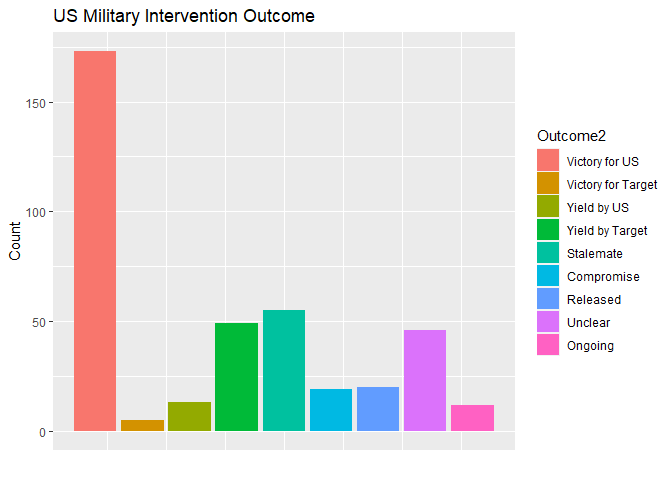
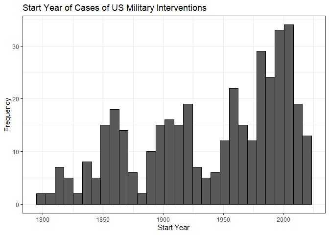
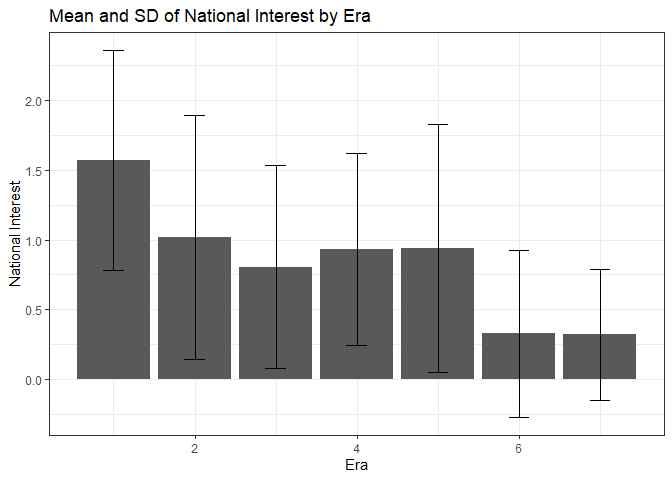
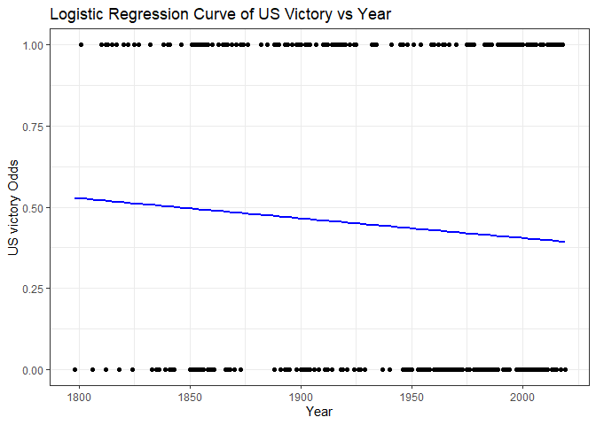

US_Military_Intervention_History
================
Ezra Hsieh
2023-12-10

# US Military Interventions over History

## MATH 167R Final Project

Author: Ezra Hsieh

## Introduction

The United States has a history of military interventions dating back to
its inception. Despite this extensive legacy, the discourse surrounding
these interventions has often lacked robust quantitative and statistical
analysis, leaving many claims about their nature, trends, and
consequences without the support of rigorous empirical evidence.
Addressing this gap, the Military Interventions Project (MIP) dataset
emerges as a pivotal resource, encompassing nearly 400 military
interventions and featuring over 200 variables. This dataset empowers
scholars to employ comprehensive statistical analyses to unravel key
questions and debates surrounding the evolution of U.S. military
interventions over the years (Kushi and Toft, 2023).

``` r
library(tidyverse)
library(readxl)
library(MASS)

MIP <- read_excel("MIP-Dataset_2022.xlsx")

# Filter cases already removed by the authors
MIP <- MIP |>
  filter(RemoveCase == 0)
```

### Categorical Variable Visualization

One of the categorical variable of my interest is the outcome of the
war. The authors have methodically categorized the results of each
military intervention into distinct classes, including “Victory for US,”
“Victory for Target,” “Yield by US,” “Yield by Target,” “Stalemate,”
“Compromise,” “Released,” “Unclear,” and “Ongoing.” The ensuing bar plot
offers a visual representation of the frequency distribution for each of
these categorical values.

``` r
# Mapping of numeric values to distinctive outcome values
outcome_label <- c("Victory for US", "Victory for Target", "Yield by US", 
                   "Yield by Target", "Stalemate", "Compromise", "Released", 
                   "Unclear", "Ongoing")

# Fix one data anomaly and Unclear values
# Then map numerical value to labels, then factor
MIP <- MIP |>
  mutate(Outcome2 = ifelse(Outcome == "0", "8", Outcome)) |>
  mutate(Outcome2 = ifelse(Outcome2 == "5; 6", "5", Outcome2)) |>
  mutate(Outcome2 = outcome_label[as.numeric(Outcome2)] ) |>
  mutate(Outcome2 = factor(Outcome2, levels = outcome_label))


# Assign numeric values to the factor levels
MIP$Outcome2_numeric <- as.numeric(MIP$Outcome2)

# Plotting with numeric values on the x-axis and a legend
MIP %>%
  ggplot(aes(x = Outcome2_numeric, fill = Outcome2)) +
  geom_bar() +
  labs(title = "US Military Intervention Outcome", x = "", y = "Count", 
       fill = "Outcome2") +
  theme(axis.text.x = element_blank(), axis.ticks.x = element_blank())
```

<!-- -->

Notably, the plot underscores that victory for the US is by far the most
common outcome.

### Continuous Variable Visualization

While the majority of variables are categorical, there exist some
noteworthy continuous variables of interest within the dataset. Among
these, a fundamental yet pivotal continuous variable is the initiation
year of each military intervention incident. This variable serves as a
foundational metric, allowing us to discern the evolving frequency of US
military interventions across time. To illustrate this, a histogram of
this variable is plotted, displaying the frequency distribution within
designated bins of years.

``` r
MIP |>
  ggplot(aes(x=styear)) +
  geom_histogram(color="black") +
  labs(title = "Start Year of Cases of US Military Interventions",
       x = "Start Year", y = "Frequency") +
  theme_bw()
```

<!-- -->

Notably, the distribution of start years of US military interventions is
concentrated in more recent years.

### Research Questions

Within the realm of theoretical perspectives, Traditional Realist
scholars assert that states deploy military force to pursue national
interests, driven by a commitment to sovereign concerns. In contrast,
alternative liberal theorists advocate for military interventions in the
name of “international moral obligations” and the promotion of liberal
values in the absent of direct security interests (Talentino 2005).
Interestingly, proponents of liberal interventionism argue that such
actions, even when conducted in foreign countries, can potentially
diminish interstate military conflicts (Kushi and Toft, 2022). Others
have argued that the increasing frequency of military interventions
itself begets more aggressive diplomacy and even higher rate of military
interventions (Toft 2018).

A critical examination of the MIP dataset by Kushi and Toft unveils
compelling insights. Their analysis reveals a striking pattern: the
“annual rate \[of U.S. military interventions\] dramatically rose during
the Cold War, and then only continued to grow, while U.S. National
Interests declined \[after the Cold War\].” (The rise of the rate of US
military interventions after the Cold War is also demonstrated by our
histogram above). To gauge the stake of U.S. “National Interests” in
each military incident, Kushi and Toft utilized categorical variables
such as “geographical contiguity, shared alliances, colonial history,
and the presence of oil and gas” (Kushi and Toft, 2023).

In this project, my objective is to build upon previous analyses and
delve deeper into the evolving dynamics of US military interventions,
aiming to explore how objectives and outcomes have transformed over
time. I seek to quantify the intricate relationship between various
objectives and outcomes, addressing the following core questions:

1.  How does the passage of time influence the objectives of US military
    interventions?
2.  In what ways, if any, has the outcome of US military interventions
    evolved over time?
3.  Can a discernible relationship be identified between the outcomes
    and objectives of US military interventions?

## 1. Change of US Military Intervention Objectives

As previously mentioned, the dataset authors undertook their analysis
and identified the National Interest Index, derived from metrics
encompassing oil, alliances, colonial history, and geographical
contiguity. However, I raise a question regarding the inclusion of
“alliances” in calculating National Interests. This inclusion appears
questionable, as alliances are frequently formed not solely for security
or geopolitical necessity but often due to ideological and institutional
relationships, particularly during the Cold War. For exploratory
purposes, a bar plot of a recalibrated National Interest Index,
excluding the alliance dummy variable, is generated to shed light on
potentially evolving military objectives over each passing era.

``` r
# Generate NI2
MIP <-
  MIP |>
  mutate(NI2 = coalesce(`Oil Dummy`, 0) + coalesce(ColonialDummy, 0) + 
           coalesce(ContiguityDummy, 0))

# Plot bar graph of means with SD as error bars
MIP |>
  group_by(Era2) |>
  summarise(
    Mean_National_Interest = mean(NI2, na.rm = TRUE),
    SD_National_Interest = sd(NI2, na.rm = TRUE)
  ) |>
  ggplot(aes(x = Era2)) +
  geom_bar(aes(y = Mean_National_Interest), stat = "identity", 
           position = "dodge") +
  geom_errorbar(
    aes(ymin = Mean_National_Interest - SD_National_Interest, 
        ymax = Mean_National_Interest + SD_National_Interest),
    position = position_dodge(0.9),
    width = 0.25
  ) +
  labs(title = "Mean and SD of National Interest by Era", 
       y = "National Interest", x = "Era") +
  theme_bw()
```

<!-- -->

The era variable delineates seven distinct time periods: 1776-1812,
1813-1864, 1865-1917, 1918-1945, 1946-1989, 1990-2000, and 2001-2017.
Observing the plot, it becomes evident that National Interests exhibit a
decreasing trend over these eras, even when excluding considerations of
alliances. Notably, there is a significant decline in national
interests, particularly pronounced after the conclusion of the Cold War,
during a period when threats to U.S. national security became
increasingly infrequent. This is true even given the fact that the
production of oil of the target nation is considered, highlighting a
noteworthy deviation from the common narrative, indicating that U.S.
military interventions have shifted away from the primary objective of
seeking energy resources in recent years.

## 2. Outcome of US Military Outcomes over the Years

As illustrated in the univariate plot depicting US military outcomes, it
is apparent that US and alliance victory stands out as the most
prevalent outcome across all US military interventions since 1776. With
this observation in mind, I aim to delve into the potential
relationships associated with US victories over the years. To streamline
the analysis, a definition of US victory is established, focusing solely
on unambiguous triumphs and disregarding instances of stalemates,
compromises, or yielding by either side. To initiate this exploration,
descriptive statistics are computed for a newly defined binary variable
representing US victories.

``` r
# Create new Binary variable of US victory
MIP <- MIP |>
  mutate(US_victory = ifelse(Outcome2=="Victory for US", 1, 0))

# Calculate the proportion of successes
table(MIP$US_victory)
```

    ## 
    ##   0   1 
    ## 219 173

``` r
prop.table(table(MIP$US_victory))
```

    ## 
    ##         0         1 
    ## 0.5586735 0.4413265

Based on descriptive statistics, it is revealed that 173 instances,
constituting 44.13% of US military interventions, resulted in decisive
victories for the US and its allies. Moving forward, my objective is to
investigate the correlation between US victories and the passage of
time. To achieve this, a logistic regression line is modeled and
visually presented in the subsequent plot.

``` r
# Fit a logistic regression model
logistic_model <- glm(US_victory ~ styear, data = MIP, family = "binomial")

# Create a logistic regression curve plot
ggplot(MIP, aes(x = styear, y = US_victory)) +
  geom_point() +                      
  geom_smooth(method = "glm", method.args = list(family = "binomial"), 
              se = FALSE, color = "blue") +  # Logistic regression curve
  labs(title = "Logistic Regression Curve of US Victory vs Year", 
       x = "Year", y = "US victory Odds") +
  theme_bw()
```

<!-- -->

``` r
summary(logistic_model)
```

    ## 
    ## Call:
    ## glm(formula = US_victory ~ styear, family = "binomial", data = MIP)
    ## 
    ## Coefficients:
    ##              Estimate Std. Error z value Pr(>|z|)
    ## (Intercept)  4.567899   3.286495   1.390    0.165
    ## styear      -0.002478   0.001695  -1.462    0.144
    ## 
    ## (Dispersion parameter for binomial family taken to be 1)
    ## 
    ##     Null deviance: 538.02  on 391  degrees of freedom
    ## Residual deviance: 535.87  on 390  degrees of freedom
    ## AIC: 539.87
    ## 
    ## Number of Fisher Scoring iterations: 4

The negative coefficient for year suggests that, on average, as year
increases by one, the log odds of US military victory decreases by
approximately 0.0025. The p-value for this relationship is 0.144, which
is greater than the significance level of 0.05. This suggests that the
effect of year on military victory may be too weak and not be
statistically significant.

## 3. Objective vs Outcome

Finally, I am keen to explore the potential relationship between the
objective of US military interventions—specifically, whether the
incident aligns with US national interest—and the resulting outcome,
specifically the attainment of a US victory. To facilitate this
examination, an additional binary variable labeled `interest` is
introduced. This variable signifies whether the National Interest Index
is greater than 0, indicating the presence of at least one national
interest motivation behind the intervention, such as oil, border
contiguity, or colonial history.

``` r
# Create interest binary variable
MIP <- MIP |>
  mutate(interest = NI2 > 0) |>
  mutate(interest = as.numeric(interest))

# Calculate the proportion of successes (with National Interest)
table(MIP$interest)
```

    ## 
    ##   0   1 
    ## 178 214

``` r
prop.table(table(MIP$interest))
```

    ## 
    ##         0         1 
    ## 0.4540816 0.5459184

As indicated by the descriptive statistics, it is evident that 214
instances, equivalent to 54.59% of US military interventions, are driven
by national interest objectives.  
For the final analysis, I would like to analyze the relationship between
national interest and US victory over a logistic regression model.

``` r
# Fit a logistic regression model
logistic_model <- glm(US_victory ~ interest, family = "binomial", data = MIP)

# Summary of the logistic regression model
summary(logistic_model)
```

    ## 
    ## Call:
    ## glm(formula = US_victory ~ interest, family = "binomial", data = MIP)
    ## 
    ## Coefficients:
    ##             Estimate Std. Error z value Pr(>|z|)  
    ## (Intercept) -0.02247    0.14992  -0.150   0.8808  
    ## interest    -0.39469    0.20492  -1.926   0.0541 .
    ## ---
    ## Signif. codes:  0 '***' 0.001 '**' 0.01 '*' 0.05 '.' 0.1 ' ' 1
    ## 
    ## (Dispersion parameter for binomial family taken to be 1)
    ## 
    ##     Null deviance: 538.02  on 391  degrees of freedom
    ## Residual deviance: 534.29  on 390  degrees of freedom
    ## AIC: 538.29
    ## 
    ## Number of Fisher Scoring iterations: 4

In summary, the logistic regression suggests a potential association
between National Interest and the log odds of US victory, with a
negative coefficient indicating a decrease in the log odds with
increasing US national interest. However, the significance of this
association is not very strong based on the p-value (0.054), and caution
is warranted in drawing definitive conclusions. Additional exploration
and consideration of the context are recommended.

## Conclusion

Following our analysis, we have identified supporting evidence
indicating a decline in US national interest as a motivating factor
behind military interventions over time. While there is some suggestive
support for the decrease in US victories over time and a potential
negative correlation between US interest and victory outcomes, the
evidence lacks robustness. A more comprehensive dataset, enriched with
additional metrics that precisely define national interest, is
imperative for a more nuanced understanding of these relationships. I
would also like to extend my exploration to encompass additional
metrics, including casualties and cost, provided that more comprehensive
and complete data become available. This expansion could offer a more
holistic understanding of the multifaceted dynamics surrounding US
military interventions.

## Bibliography

Kushi, S., & Toft, M. D. (2023). Introducing the Military Intervention
Project: A New Dataset on US Military Interventions, 1776–2019. *Journal
of Conflict Resolution*

Talentino, Andrea K. 2005. *Military Intervention after the Cold War:
The Evolution of Theory and Practice.* Athens, OH: Ohio University
Press.

Toft, M. D. (2018, May 14). The Dangerous Rise of Kinetic Diplomacy.
*War on the Rocks*.
<https://warontherocks.com/2018/05/the-dangerous-rise-of-kinetic-diplomacy/>
